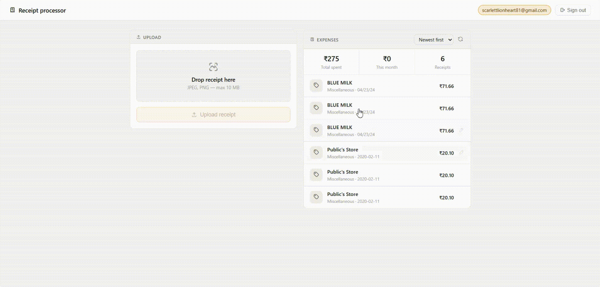
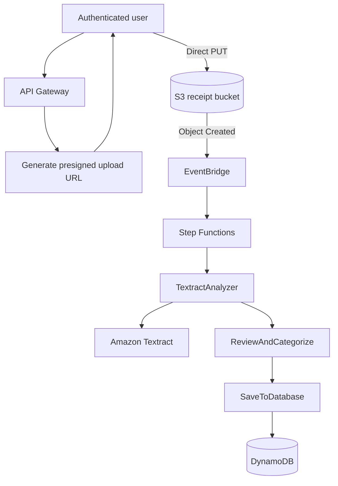
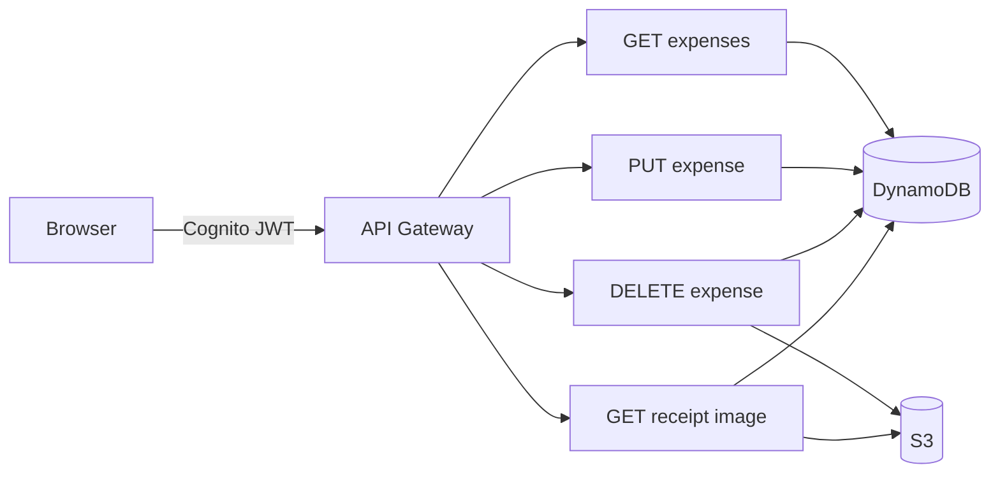
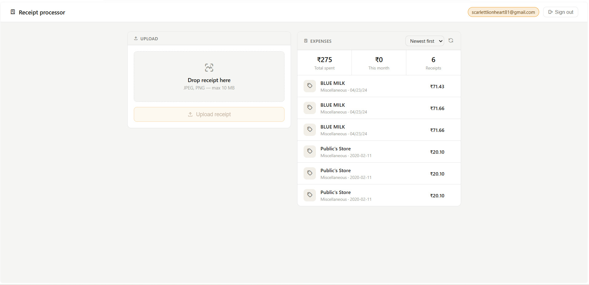
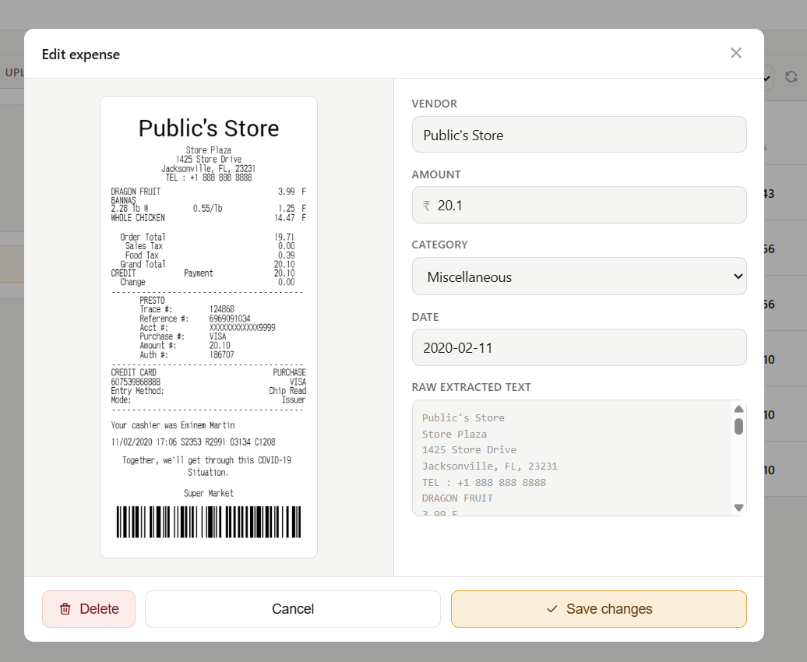

# Serverless Receipt Processor

**A serverless receipt-processing application that converts receipt images into structured expenses using Amazon Textract, an event-driven AWS workflow, and authenticated user-scoped storage.**

<p align="center">
  
</p>

<p align="center">
  <strong>Cognito · API Gateway · S3 · EventBridge · Step Functions · Lambda · Textract · DynamoDB · CloudFront</strong>
</p>

> **Visual placeholders:** put your GIF at `docs/media/upload-demo.gif`, homepage screenshot at `docs/media/dashboard.png`, and edit/review screenshot at `docs/media/review-edit.png`. The Markdown below will render automatically once those files exist.

---

## Architecture

### Receipt processing path



### Review and expense management



---

## How it works

1. The user signs in through **Amazon Cognito** using Authorization Code + PKCE.
2. `POST /upload-url` returns a short-lived, user-scoped S3 upload URL.
3. The browser uploads the receipt **directly to S3**.
4. S3 sends an `Object Created` event to **EventBridge**.
5. EventBridge starts an **Express Step Functions** workflow.
6. `TextractAnalyzer` runs `DetectDocumentText`.
7. `ReviewAndCategorize` identifies the vendor, final amount, date, and category.
8. `SaveToDatabase` stores the structured expense in **DynamoDB**.
9. The dashboard lets the authenticated user review, edit, delete, and reopen the original receipt.

<p align="center">
  
</p>

---

## The parser: resolving ambiguous totals

Textract provides OCR text. The application still has to decide which detected value is the actual amount to store.

A typical receipt can contain several plausible candidates:

```text
ITEM A           999.00
SUBTOTAL         820.00
CGST              24.60
SGST              24.60
TOTAL            869.20
```

The parser ranks explicit payment labels before generic numeric fallbacks:

```text
GRAND TOTAL / AMOUNT PAID / BALANCE DUE
                     ↓
               NET TOTAL
                     ↓
                  TOTAL
                     ↓
       currency-value fallback
                     ↓
          decimal fallback
```

This prevents a large item price or pre-tax subtotal from automatically becoming the expense amount. A regression test also covers the specific case where `TOTAL` must not match inside `SUBTOTAL`.

The parser additionally handles:

- known-vendor and receipt-header detection;
- `₹`, `Rs`, and `INR` amount formats;
- common numeric and month-name date formats;
- vendor-based expense categorization.

<p align="center">
  
</p>

The original receipt remains available through a short-lived S3 URL, so extracted fields can be reviewed and corrected rather than treating OCR output as ground truth.

---

## Results / Metrics

> **Do not fill these with estimates disguised as measurements.** Replace the placeholders after running the test plan described below.

| Metric | Result | Test condition |
|---|---:|---|
| End-to-end processing time | `p50: TBD` · `p95: TBD` | `TBD receipts`, upload complete → DynamoDB record available |
| Final amount accuracy | `TBD%` | Exact match against manually labelled totals |
| Vendor accuracy | `TBD%` | Exact / normalized match |
| Date accuracy | `TBD%` | Parsed date matches labelled receipt date |
| Successful processing rate | `TBD / TBD` | Workflow completed and record stored |
| Manual correction rate | `TBD / TBD` | Any vendor/amount/date correction required |
| Parser regression suite | `5 / 5 passing` | Current deterministic parser cases |
| Estimated AWS cost | `TBD / 1,000 receipts` | Calculated from measured service usage |

---

## AWS Services

| Service | Role |
|---|---|
| **Amazon Cognito** | User authentication and JWT issuance |
| **API Gateway** | Authenticated REST API |
| **Amazon S3** | Direct receipt upload and original image storage |
| **Amazon EventBridge** | Routes new receipt events into the workflow |
| **AWS Step Functions** | Orchestrates OCR → parsing → persistence |
| **AWS Lambda** | API handlers and processing stages |
| **Amazon Textract** | OCR with `DetectDocumentText` |
| **Amazon DynamoDB** | User-scoped expense storage |
| **Amazon CloudFront** | HTTPS delivery for the static frontend |
| **AWS IAM** | Service-to-service permissions |

---

## Infrastructure as Code — AWS SAM

The project includes `template.yaml` to reproduce the serverless architecture with AWS SAM.

### Prerequisites

- AWS CLI
- AWS SAM CLI
- an authenticated AWS profile
- Python 3.13-compatible Lambda build environment

### Deploy

```bash
sam validate
sam build
sam deploy --guided
```

During the guided deployment, provide a unique `CognitoDomainPrefix`.

The stack creates:

- Cognito user pool, public app client, and hosted domain;
- API Gateway REST API with Cognito authorizer;
- receipt and frontend S3 buckets;
- EventBridge-triggered Express Step Functions workflow;
- eight Lambda functions;
- DynamoDB table and `user_id-upload_date-index` GSI;
- CloudFront distribution with Origin Access Control.

### Frontend configuration

After deployment, copy these SAM stack outputs into the frontend configuration:

```text
ApiBaseUrl
CognitoClientId
CognitoDomain
FrontendUrl
```

Then upload the static frontend:

```bash
aws s3 sync frontend/ s3://<FrontendBucketName> --delete
```

If replacing an existing frontend version, invalidate CloudFront:

```bash
aws cloudfront create-invalidation \
  --distribution-id <distribution-id> \
  --paths "/*"
```

### SAM readiness changes required in the Lambda code

Resource names should come from environment variables instead of hardcoded placeholders.

For `lambdas/presigned-url/lambda_function.py`:

```python
import os
BUCKET_NAME = os.environ["RECEIPT_BUCKET"]
```

For every DynamoDB Lambda:

```python
import os
table = dynamodb.Table(os.environ["EXPENSES_TABLE"])
```

For Lambda functions that also access the receipt bucket:

```python
BUCKET_NAME = os.environ["RECEIPT_BUCKET"]
```

`template.yaml` already supplies these variables and the matching IAM permissions.

---

## Testing

Parser regression tests are isolated from Textract so deterministic parsing behavior can be checked without making AWS calls:

```bash
python -m unittest tests/test_parser.py
```

Current cases cover:

- final total vs subtotal and tax;
- `GRAND TOTAL` vs an earlier `TOTAL`;
- large item price vs labelled total;
- currency fallback;
- known vendor + Indian-style date parsing.

### Metrics test plan

For a meaningful portfolio benchmark, use **20–30 varied receipts** rather than inventing numbers.

Create a simple ground-truth sheet with:

```text
receipt_id
expected_vendor
expected_total
expected_date
upload_timestamp
record_available_timestamp
manual_correction_required
workflow_success
```

Then report:

- p50 and p95 processing time;
- amount/vendor/date accuracy;
- successful processing rate;
- manual correction rate.

Keep the test size next to every metric.

---

## Key design decisions

**Direct-to-S3 uploads.** Receipt binaries do not pass through API Gateway or Lambda. The authenticated client receives a short-lived presigned URL and uploads directly to S3.

**PKCE authentication.** The frontend is a public browser client, so Cognito Authorization Code + PKCE avoids embedding a client secret.

**EventBridge + Step Functions.** S3 upload events are decoupled from processing, while OCR, parsing, and persistence remain separate observable stages.

**User-scoped data model.** DynamoDB uses `user_id` as the partition key and `expense_id` as the sort key, with a `user_id-upload_date-index` for chronological queries.

**Human correction.** OCR is best-effort. The application keeps the source receipt accessible and exposes authenticated edit endpoints for extracted fields.

---

## Engineering Challenges

A few issues required debugging across AWS service boundaries:

| Problem | Root cause | Resolution |
|---|---|---|
| CloudFront returned `Access Denied` | S3 origin/OAC configuration was incorrect | Reconfigured the origin and attached OAC correctly |
| Update request returned `403 Missing Authentication Token` | API method was attached to the wrong resource path | Moved the update method to `/expenses/{expense_id}` |
| DELETE worked differently in browser testing | API Gateway preflight did not allow `DELETE` | Corrected the `OPTIONS` response and redeployed |
| Update Lambda failed before writing | IAM policy did not allow the ownership `GetItem` check | Added the required DynamoDB permission |
| Existing expense returned `404` for a valid user | Early records used the wrong identity value | Propagated the Cognito `sub` through the user-scoped S3 key |

---

## API

| Method | Route | Purpose |
|---|---|---|
| `POST` | `/upload-url` | Generate a short-lived S3 upload URL |
| `GET` | `/expenses` | List the authenticated user's expenses |
| `PUT` | `/expenses/{expense_id}` | Update an expense |
| `DELETE` | `/expenses/{expense_id}` | Delete an expense |
| `GET` | `/expenses/{expense_id}/image` | Retrieve a short-lived receipt image URL |

---

## Data model

```text
expenses
├── PK  user_id
├── SK  expense_id
└── GSI user_id-upload_date-index
        ├── PK user_id
        └── SK upload_date
```

Each expense stores the parsed fields, source S3 key, upload timestamp, processing status, and a bounded copy of the OCR text.

---

## Limitations

- OCR quality depends on receipt image quality and Textract output.
- Receipt interpretation is heuristic rather than a trained extraction model.
- Vendor-based categorization is intentionally simple.
- The current benchmark set is small until the metrics test is completed.
- The application has not been load-tested for high-volume production traffic.

---

## Repository structure

```text
.
├── frontend/
│   ├── index.html
│   ├── app.js
│   └── styles.css
├── lambdas/
├── statemachine/
├── eventbridge/
├── api-gateway/
├── cognito/
├── storage/
├── tests/
├── docs/
│   └── media/
├── template.yaml
└── README.md
```

---

## Tech stack

`Python 3.13` · `AWS SAM` · `Lambda` · `API Gateway` · `Cognito` · `S3` · `EventBridge` · `Step Functions` · `Textract` · `DynamoDB` · `CloudFront`
