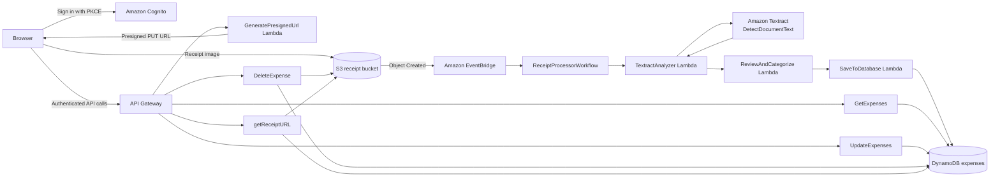

# Serverless Receipt Processor

An AWS serverless receipt application I built to learn how managed cloud services behave when they have to work together in a real authenticated workflow—not just as isolated examples.

A user signs in with Cognito, uploads a receipt directly to S3 through a presigned URL, and the S3 object event is routed through EventBridge into a Step Functions workflow. Textract performs generic OCR, custom Python logic selects the vendor, amount, date, and category, and the resulting expense is stored in DynamoDB for review and editing.

> This project was built incrementally through the AWS Console. The repository was assembled afterward from the deployed Lambda code and exported configuration, then cleaned to represent the maintained workflow without pretending the original project was infrastructure-as-code first.

## What I wanted to learn

The project started as a practical way to become comfortable with AWS service integration:

- authenticated browser flows with **Cognito Authorization Code + PKCE**;
- **API Gateway** routing and Cognito authorization;
- direct browser-to-**S3** uploads using presigned URLs;
- event-driven processing with **EventBridge** and **Step Functions**;
- **Lambda** execution roles and service-to-service permissions;
- generic OCR with **Amazon Textract**;
- user-scoped storage and access patterns in **DynamoDB**;
- private static hosting with **CloudFront + S3 Origin Access Control**.

Receipt parsing became the main application-specific problem inside that cloud workflow: Textract can detect text, but the application still has to decide which detected value is actually the final amount, which line is the merchant, and what should happen when OCR is wrong.

## Live workflow



### Processing path

1. The browser authenticates through Cognito's hosted login using Authorization Code + PKCE.
2. `POST /upload-url` returns a short-lived, user-scoped presigned S3 PUT URL.
3. The browser uploads the receipt directly to S3 instead of sending the image through API Gateway or Lambda.
4. S3 emits an `Object Created` event to EventBridge.
5. EventBridge starts the `ReceiptProcessorWorkflow` Step Functions state machine.
6. `TextractAnalyzer` calls `DetectDocumentText` and passes the returned LINE blocks forward.
7. `ReviewAndCategorize` applies the custom receipt parser and builds an expense record.
8. `SaveToDatabase` stores the record in DynamoDB.
9. The authenticated dashboard can list, edit, delete, and retrieve the original receipt image through the API.

The maintained EventBridge configuration is captured in [`eventbridge/s3-receipt-upload-trigger.json`](eventbridge/s3-receipt-upload-trigger.json), and the cleaned state-machine definition is in [`statemachine/workflow.asl.json`](statemachine/workflow.asl.json).

## What Textract does vs. what the parser does

The project uses `textract.detect_document_text()`. Textract returns generic OCR blocks; it does **not** decide which number is the final amount or which line is the vendor.

The custom parser in [`lambdas/review-categorize/lambda_function.py`](lambdas/review-categorize/lambda_function.py) handles:

- **vendor detection** — known merchant matching, then header heuristics while skipping obvious metadata;
- **total selection** — semantically ranked labels such as `GRAND TOTAL`, `AMOUNT PAID`, `NET TOTAL`, and `TOTAL`, followed by currency/decimal fallbacks;
- **date extraction** — several common numeric and month-name formats;
- **categorization** — vendor-based rules for common spending categories.

### Why total selection needed iteration

A receipt can contain several plausible monetary values:

```text
SUBTOTAL       820.00
CGST            24.60
SGST            24.60
TOTAL          869.20
```

Early parsing logic could select an item amount or pre-tax subtotal when multiple total-like values were present. The maintained parser treats explicit final-payment labels as stronger evidence and ensures `TOTAL` does not accidentally match inside `SUBTOTAL`.

Other failures encountered during testing included incomplete OCR, inconsistent `₹` / `Rs` / `INR` formatting, and semantic OCR errors such as an item name being recognized as a different phrase. The parser can improve selection when the correct text exists in the OCR output; it cannot reliably reconstruct information that Textract itself misread.

Because of that limitation, the application preserves the original receipt image and allows users to correct extracted expense fields from the dashboard.

## Authentication and data isolation

The API Gateway methods are protected by a Cognito user-pool authorizer.

Receipt object keys are created under:

```text
uploads/{user_id}/{timestamp}-{uuid}.jpg
```

The `user_id` is the authenticated Cognito `sub`. In the maintained processing code, `TextractAnalyzer` derives that identity from the user-scoped object key and carries it through the workflow rather than accepting a free-form user ID from the processing event.

DynamoDB uses:

```text
Partition key: user_id
Sort key:      expense_id
```

with a GSI for chronological per-user queries:

```text
user_id-upload_date-index
Partition key: user_id
Sort key:      upload_date
```

This keeps list/read/update/delete operations scoped to the authenticated user.

## API surface

The maintained route set is:

| Method | Route | Purpose |
|---|---|---|
| `POST` | `/upload-url` | Generate a user-scoped presigned S3 upload URL |
| `GET` | `/expenses` | Return recent expenses for the authenticated user |
| `PUT` | `/expenses/{expense_id}` | Update allowed expense fields after ownership verification |
| `DELETE` | `/expenses/{expense_id}` | Delete an expense and best-effort remove its receipt image |
| `GET` | `/expenses/{expense_id}/image` | Generate a short-lived presigned S3 GET URL |

The console export under [`api-gateway/`](api-gateway/) is retained as a historical deployment snapshot. It contains one documented stale `PUT /expenses` method from an earlier routing mistake; [`api-gateway/README.md`](api-gateway/README.md) explains the difference between that snapshot and the maintained route set.

## Problems I actually had to debug

The finished diagram hides most of the difficult work. Some of the issues encountered while building the system were:

| Symptom | Root cause | Fix / lesson |
|---|---|---|
| CloudFront returned `Access Denied` | Distribution used the wrong origin configuration, so OAC could not sign requests to the private S3 origin | Corrected the S3 origin configuration, attached OAC, and redeployed |
| CloudFront kept serving old frontend files | Cached objects were still valid | Invalidated changed paths after S3 uploads |
| `403 Missing Authentication Token` during update | `PUT` was initially created on `/expenses` instead of `/expenses/{expense_id}` | Fixed the API Gateway resource/method mapping instead of treating it as a Cognito failure |
| DELETE failed only in the browser | CORS preflight did not allow `DELETE` | Updated the `OPTIONS` response and redeployed the API stage |
| CORS looked broken after the fix | Browser cached the old preflight response | Retested after clearing the cached response |
| PUT worked from Postman but failed from the browser | Cognito ID token expired during a long debugging session | Re-authenticated and checked token lifetime before changing backend code |
| Cognito login succeeded but redirect failed | CloudFront URL was missing from allowed callback URLs | Added the deployed frontend URL to the app client configuration |
| Update Lambda failed before `UpdateItem` | Its execution role lacked DynamoDB permission for the ownership `GetItem` check | Corrected the Lambda role/policy |
| Valid expense returned `404 Expense not found` | Early records were stored under `test-user`, so the DynamoDB composite key did not match the Cognito `sub` | Fixed identity propagation through the user-scoped S3 key |

A longer record of these failures and what they taught me is in [`docs/engineering-notes.md`](docs/engineering-notes.md).

## Parser regression tests

The small regression suite in [`tests/test_parser.py`](tests/test_parser.py) checks the custom parser without repeatedly calling Textract. This does not replace AWS testing—the deployed application still uses Textract for OCR. It simply makes deterministic parser behavior testable once OCR text is already known.

Current cases cover:

- subtotal + tax + final total;
- an earlier `TOTAL` followed by a stronger `GRAND TOTAL`;
- a large item price that should not beat an explicitly labeled total;
- currency-only fallback behavior;
- an Indian-style date plus known-vendor categorization.

Run locally with:

```bash
python -m unittest tests/test_parser.py
```

## Design decisions

### Cognito PKCE instead of a client secret

The frontend is a browser application, so it cannot safely keep a Cognito client secret. Authorization Code + PKCE provides a redirect-based login flow without embedding one in the client.

### Presigned S3 uploads

Receipt images bypass API Gateway and Lambda. The browser receives a short-lived URL and uploads directly to S3, keeping binary payload handling out of the API path.

### EventBridge between S3 and Step Functions

The receipt bucket emits object-created events through EventBridge. EventBridge transforms the S3 event into the small `{bucket, key}` input expected by the workflow and targets the Step Functions state machine.

### Step Functions for visible workflow stages

OCR, parsing, and persistence are separate Lambda responsibilities. Step Functions makes those stages explicit and gives each step its own execution/failure boundary instead of hiding the entire pipeline inside one Lambda.

### DynamoDB query pattern

Expense listing uses the `user_id-upload_date-index` GSI rather than scanning the table. The application queries only the current user's partition and orders results by upload timestamp.

### Human correction instead of pretending OCR is perfect

OCR and heuristic parsing are best-effort. The application keeps the original receipt available through a short-lived S3 URL and lets the user correct vendor, amount, category, and date through the authenticated update endpoint.

## Repository structure

```text
serverless-receipt-processor/
├── README.md
├── api-gateway/          # historical console export + maintained route notes
├── cognito/              # sanitized Cognito configuration snapshot
├── docs/
│   └── engineering-notes.md
├── eventbridge/
│   └── s3-receipt-upload-trigger.json
├── iam/                  # sanitized IAM policy snapshot
├── lambdas/
│   ├── delete-expense/
│   ├── get-expenses/
│   ├── presigned-url/
│   ├── receipt-url/
│   ├── review-categorize/
│   ├── save-to-db/
│   ├── textract-extract/
│   └── update-expense/
├── statemachine/
│   └── workflow.asl.json
├── storage/
│   └── dynamo.json
└── tests/
    └── test_parser.py
```

The deployed static frontend is still hosted through CloudFront/S3 but is not included in this repository snapshot yet.

## Known limitations

- Receipt parsing is heuristic and intentionally limited to a small set of useful expense fields.
- OCR quality is controlled by Textract and depends on receipt image quality.
- Semantic OCR errors cannot always be corrected downstream and may require user edits.
- Categorization is vendor-based rather than a learned classifier.
- The project was built console-first and is not currently a one-command SAM/CDK/Terraform deployment.
- The application has been functionally tested as a personal project, not load-tested as a production service.
- Receipt deletion removes the DynamoDB item first and treats S3 cleanup as best-effort, so an S3 failure can leave an orphaned image.

## Scope deliberately removed

A monthly-report branch was started during development but was not part of the core receipt workflow and was later abandoned. The maintained state-machine definition removes that path instead of completing an unused feature only to make the architecture larger.

## Tech stack

`Python` · `AWS Lambda` · `Amazon API Gateway` · `Amazon Cognito` · `Amazon S3` · `Amazon EventBridge` · `AWS Step Functions` · `Amazon Textract` · `Amazon DynamoDB` · `Amazon CloudFront` · `AWS IAM`
