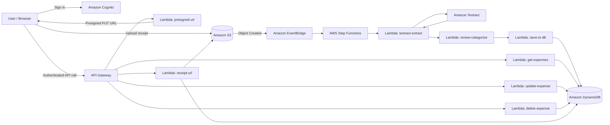
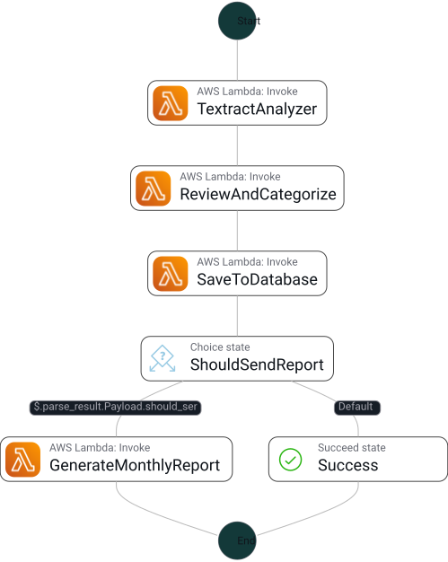

<h1 align="center">Serverless Receipt Processor</h1>

<p align="center">
  <strong>Authenticated receipt ingestion, OCR extraction, automatic expense categorization, and per-user expense storage — built entirely on AWS managed services.</strong>
</p>

<p align="center">
  
  
  
  
  
  
</p>

---

## Overview

This project is an end-to-end **serverless receipt-processing pipeline** on AWS. A signed-in user uploads a receipt image, the backend extracts receipt text with Amazon Textract, parses useful expense fields, automatically categorizes the transaction, and stores the result as a user-scoped DynamoDB record.

The deployed application also exposes authenticated CRUD APIs for reviewing and managing expenses, while original receipt images remain in S3 and are accessed through short-lived presigned URLs.

### At a glance

| Capability | Implementation |
|---|---|
| Authentication | Amazon Cognito with Authorization Code + PKCE |
| Direct receipt upload | Presigned Amazon S3 PUT URL |
| Upload event routing | Amazon S3 Object Created events through Amazon EventBridge |
| OCR | Amazon Textract |
| Workflow orchestration | AWS Step Functions |
| Receipt parsing | Python Lambda logic for vendor, total, date, and category |
| Expense storage | Amazon DynamoDB |
| Per-user isolation | Cognito `sub`, user-scoped S3 keys, DynamoDB queries by `user_id` |
| API layer | Amazon API Gateway + Cognito authorizer |
| Receipt retrieval | Fresh presigned S3 URLs |
| Frontend delivery | Static SPA deployed through CloudFront |

---

## Architecture



### Processing flow

```text
Authenticated user
      ↓
POST /upload-url
      ↓
Presigned S3 upload
      ↓
Receipt image stored under uploads/{user_id}/...
      ↓
S3 Object Created event
      ↓
EventBridge rule
      ↓
Step Functions workflow
      ↓
Textract OCR
      ↓
Parse + categorize receipt
      ↓
Save structured expense record
      ↓
DynamoDB
```

---

## Step Functions workflow

The OCR path is deliberately broken into separate responsibilities instead of one large Lambda:

1. **`textract-extract`** — runs Textract and forwards OCR blocks.
2. **`review-categorize`** — extracts receipt text, detects vendor / total / date, applies categorization rules, and builds the expense record.
3. **`save-to-db`** — normalizes the record and persists it to DynamoDB.

<p align="center">
  
</p>

The exported state machine definition is available at [`statemachine/workflow.asl.json`](statemachine/workflow.asl.json).

---

## Receipt intelligence

The parser is designed around real-world receipt variation rather than one rigid template.

### Vendor detection

The categorization Lambda checks known merchants first and then falls back to receipt-header heuristics while filtering common non-vendor lines such as GST, tax, invoice, date, phone, and address text.

### Amount extraction

Multiple strategies are used in sequence:

- labeled totals such as `TOTAL`, `NET AMOUNT`, `AMOUNT PAID`, and `BALANCE DUE`
- currency-prefixed values such as `₹`, `Rs`, and `INR`
- largest plausible currency amount
- largest standalone decimal amount as a final fallback

### Date extraction

The parser supports several common formats, including:

```text
YYYY-MM-DD
DD/MM/YYYY
DD-MM-YYYY
DD/MM/YY
15 Jul 2024
15-Jul-24
```

### Automatic categories

Vendor and receipt text are matched against practical categories such as:

`Food & Dining` · `Groceries` · `Online Shopping` · `Fuel & Transport` · `Health & Pharmacy` · `Utilities` · `Miscellaneous`

---

## Authentication & data isolation

The API is protected by a Cognito authorizer. Lambda functions read the authenticated user's Cognito `sub` from API Gateway claims rather than accepting an arbitrary user ID from the client.

Receipt uploads are stored using a user-scoped key pattern:

```text
uploads/{user_id}/{timestamp}-{uuid}.jpg
```

That user identity is carried through the processing pipeline and stored with the final expense record. Expense listing uses the DynamoDB `user_id-upload_date-index`, so users query only records associated with their own identity.

Presigned upload and image-view URLs are short-lived and generated only when requested.

---

## API

All application routes are protected by the Cognito authorizer.

| Method | Route | Purpose |
|---|---|---|
| `POST` | `/upload-url` | Generate a presigned S3 URL for a new receipt |
| `GET` | `/expenses` | Return recent expenses for the authenticated user |
| `PUT` | `/expenses/{expense_id}` | Update an expense |
| `DELETE` | `/expenses/{expense_id}` | Delete an expense |
| `GET` | `/expenses/{expense_id}/image` | Generate a fresh URL for the original receipt image |

The exported API Gateway definition is available in [`api-gateway/receipt_processor_API-prod-swagger.json`](api-gateway/receipt_processor_API-prod-swagger.json).

---

## Data model

The DynamoDB table uses a composite primary key:

```text
Partition key: user_id
Sort key:      expense_id
```

and a GSI for chronological per-user queries:

```text
user_id-upload_date-index
Partition key: user_id
Sort key:      upload_date
```

A processed record is shaped roughly like this:

```json
{
  "user_id": "cognito-sub",
  "expense_id": "uuid",
  "vendor": "DMart",
  "amount": 1249.50,
  "category": "Groceries",
  "expense_date": "2026-06-11",
  "upload_date": "2026-06-11T12:34:56",
  "original_key": "uploads/user-id/receipt.jpg",
  "raw_text": "...",
  "status": "processed"
}
```

See [`storage/dynamo.json`](storage/dynamo.json) for the exported table definition.

---

## Lambda responsibilities

| Lambda | Responsibility |
|---|---|
| `presigned-url` | Authenticates the request and generates a user-scoped S3 upload URL |
| `textract-extract` | Executes receipt OCR through Amazon Textract |
| `review-categorize` | Parses OCR output and categorizes the expense |
| `save-to-db` | Writes the normalized expense record to DynamoDB |
| `get-expenses` | Queries recent expenses using the user/date GSI |
| `update-expense` | Updates editable expense fields |
| `delete-expense` | Removes a user's expense record |
| `receipt-url` | Generates a fresh URL for viewing the original receipt image |

---

## Repository structure

```text
serverless-receipt-processor/
├── README.md
├── api-gateway/
│   ├── receipt_processor_API-prod-swagger.json
│   └── restapi-paths
├── cognito/
│   └── config.json
├── iam/
│   └── role-policies.json
├── lambdas/
│   ├── delete-expense/
│   ├── get-expenses/
│   ├── presigned-url/
│   ├── receipt-url/
│   ├── review-categorize/
│   ├── save-to-db/
│   ├── textract-extract/
│   └── update-expense/
├── statemachine/
│   ├── stepfunctions_graph.png
│   ├── stepfunctions_graph.svg
│   └── workflow.asl.json
└── storage/
    └── dynamo.json
```

This repository captures the backend code and exported AWS configuration used by the deployed project. The deployed static frontend is not included in this repository snapshot.

---

## AWS services used

| Service | Role in the system |
|---|---|
| **Amazon Cognito** | Authentication and token issuance |
| **Amazon API Gateway** | Authenticated REST API |
| **AWS Lambda** | Stateless business logic |
| **Amazon S3** | Original receipt image storage and upload events |
| **Amazon EventBridge** | Routes S3 Object Created events into the processing workflow |
| **AWS Step Functions** | OCR pipeline orchestration |
| **Amazon Textract** | Receipt OCR |
| **Amazon DynamoDB** | Structured expense storage |
| **Amazon CloudFront** | Frontend delivery in the deployed application |
| **AWS IAM** | Service-to-service permissions |

---

## Development and deployment

The project was built incrementally through the AWS Console. The repository captures the Lambda code and exported configuration from that working deployment rather than presenting a reconstructed one-command deployment as if it were how the project was originally built.

The live processing path uses an S3 `Object Created` event, an EventBridge rule, and the `ReceiptProcessorWorkflow` Step Functions state machine. Infrastructure-as-code is intentionally not the focus of this repository; the emphasis is on the AWS service integration and the application logic that was actually built and debugged.

---

## Design decisions

### PKCE for a public client

The frontend uses Cognito's Authorization Code + PKCE flow because a browser SPA cannot securely hold a client secret.

### Direct-to-S3 uploads

Images do not pass through API Gateway or Lambda. The client receives a short-lived presigned URL and uploads directly to S3, reducing backend payload handling.

### EventBridge + Step Functions

S3 object-created events are routed through EventBridge into the Step Functions workflow. OCR, parsing, and storage remain visible workflow stages rather than being hidden inside one large Lambda.

### Query instead of table scans

Expense retrieval uses the `user_id-upload_date-index`, allowing efficient user-scoped ordering rather than scanning the entire DynamoDB table.

### Parsing tuned for Indian receipts

The receipt parser includes support for common Indian vendors, `₹` / `Rs` / `INR` amount formats, multiple date layouts, and merchant-specific categorization heuristics.

---

## Tech stack

<p>
  <code>Python</code> ·
  <code>AWS Lambda</code> ·
  <code>API Gateway</code> ·
  <code>Cognito</code> ·
  <code>S3</code> ·
  <code>EventBridge</code> ·
  <code>Step Functions</code> ·
  <code>Textract</code> ·
  <code>DynamoDB</code> ·
  <code>CloudFront</code>
</p>
