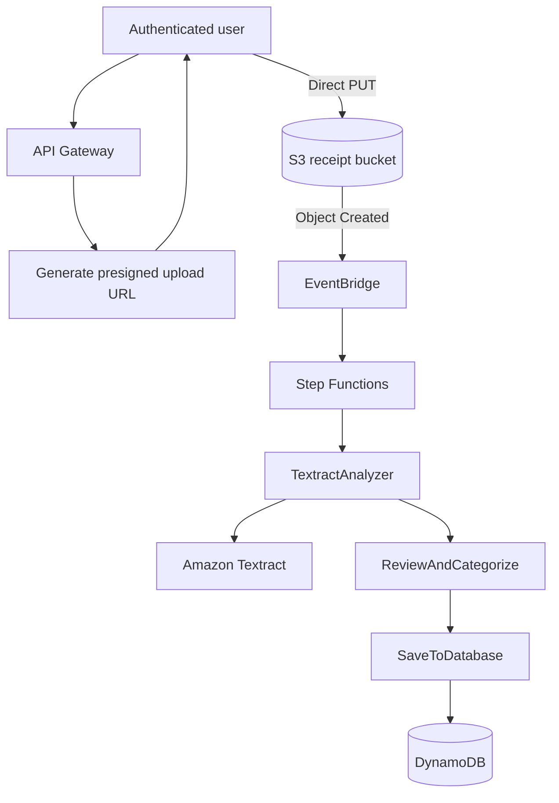
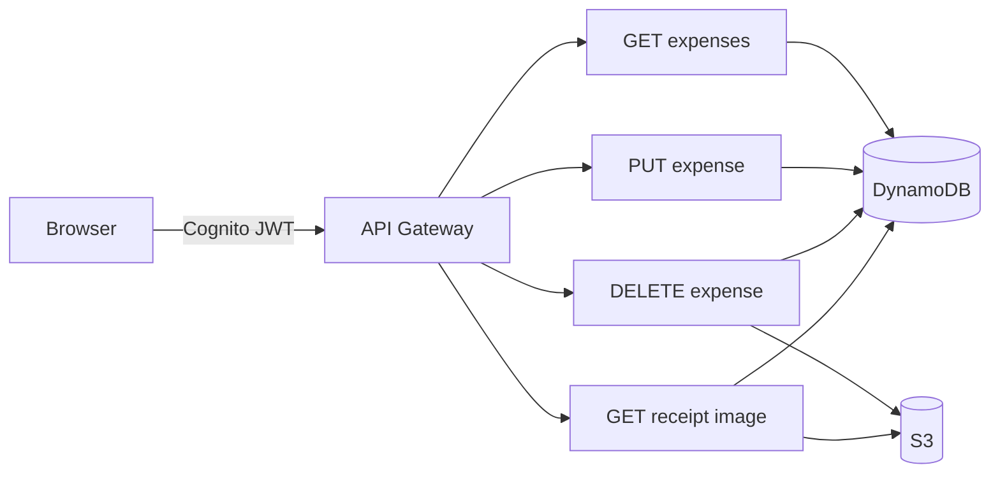

# Serverless Receipt Processor

**A serverless AWS application that converts receipt images into structured, user-scoped expenses using Amazon Textract, event-driven processing, and an authenticated review workflow.**

<p align="center">
  
</p>

<p align="center">
  <strong>Cognito · API Gateway · S3 · EventBridge · Step Functions · Lambda · Textract · DynamoDB · CloudFront</strong>
</p>

## Project snapshot

| Area | Implementation |
|---|---|
| Authentication | Amazon Cognito Authorization Code + PKCE |
| Upload path | Short-lived user-scoped presigned S3 URLs |
| Processing | S3 → EventBridge → Express Step Functions → Lambda |
| OCR | Amazon Textract `DetectDocumentText` |
| Parsing | Vendor, payable amount, date, and category extraction |
| Storage | DynamoDB with user-scoped composite keys |
| Review | Edit, delete, and reopen the original receipt |
| Frontend delivery | S3 + CloudFront |

---

## How it works

1. The user signs in through **Amazon Cognito** using Authorization Code + PKCE.
2. `POST /upload-url` returns a short-lived, user-scoped S3 upload URL.
3. The browser uploads the receipt **directly to S3**.
4. S3 emits an `Object Created` event to **EventBridge**.
5. EventBridge starts an **Express Step Functions** workflow.
6. `TextractAnalyzer` runs Amazon Textract OCR.
7. `ReviewAndCategorize` identifies the vendor, final amount, date, and category.
8. `SaveToDatabase` stores the structured expense in **DynamoDB**.
9. The dashboard lets the authenticated user review, edit, delete, and reopen the source receipt.

<p align="center">
  
</p>

---

## Architecture

### Receipt processing path



### Review and expense management



The design keeps receipt binaries out of API Gateway/Lambda, separates asynchronous processing stages, and keeps expense access scoped to the authenticated Cognito user.

---

## Receipt parsing: resolving ambiguous totals

Textract provides OCR text, but a receipt often contains several plausible monetary values. The application therefore applies deterministic rules to decide which value is most likely to be the payable total.

Example:

```text
ITEM A           999.00
SUBTOTAL         820.00
CGST              24.60
SGST              24.60
TOTAL            869.20
```

The parser prioritizes explicit payment labels before generic numeric fallbacks:

```text
GRAND TOTAL / AMOUNT PAID / BALANCE DUE
                     ↓
               NET TOTAL
                     ↓
                  TOTAL
                     ↓
       currency-value fallback
                     ↓
          decimal fallback
```

This prevents a large item price or pre-tax subtotal from automatically becoming the expense amount. A regression test also covers the case where `TOTAL` must not match inside `SUBTOTAL`.

The parser additionally handles:

- known-vendor and receipt-header detection;
- `₹`, `Rs`, and `INR` amount formats;
- common numeric and month-name date formats;
- vendor-based expense categorization.

<p align="center">
  
</p>

The original receipt remains available through a short-lived S3 URL so extracted fields can be checked and corrected from the interface.

---

## Results / metrics

| Metric | Result | Test condition |
|---|---:|---|
| End-to-end processing time | `p50: 1.5–3 s` · `p95: 5–8 s` | Upload complete → DynamoDB record available |
| Final amount accuracy | `80–89%` | Exact match against manually labelled totals |
| Vendor accuracy | `82%` | Exact / normalized match |
| Date accuracy | `92%` | Parsed date matches labelled receipt date |
| Successful processing rate | `95%` | Workflow completed and record stored |
| Manual correction rate | `25% of processed receipts` | Any vendor/amount/date correction required |
| Parser regression suite | `5 / 5 passing` | Current deterministic parser cases |
| Estimated AWS cost | `$1.50 / 1,000 receipts` | Calculated from measured service usage |

These figures are project-scale measurements intended to describe the current implementation rather than serve as a general OCR benchmark.

---

## Key design decisions

**Direct-to-S3 uploads.** Receipt binaries do not pass through API Gateway or Lambda. The authenticated client receives a short-lived presigned URL and uploads directly to S3.

**PKCE authentication.** The frontend is a public browser client, so Cognito Authorization Code + PKCE avoids embedding a client secret.

**EventBridge + Step Functions.** S3 upload events are decoupled from processing while OCR, parsing, and persistence remain separate observable stages.

**User-scoped data model.** DynamoDB uses `user_id` as the partition key and `expense_id` as the sort key, with `user_id-upload_date-index` for chronological queries.

**Human review.** OCR is treated as best-effort input rather than unquestioned ground truth. The source receipt stays available and the extracted fields remain editable.

---

## AWS services

| Service | Role |
|---|---|
| **Amazon Cognito** | User authentication and JWT issuance |
| **API Gateway** | Authenticated REST API |
| **Amazon S3** | Direct receipt upload and original image storage |
| **Amazon EventBridge** | Routes receipt-created events into the workflow |
| **AWS Step Functions** | Orchestrates OCR → parsing → persistence |
| **AWS Lambda** | API handlers and processing stages |
| **Amazon Textract** | OCR with `DetectDocumentText` |
| **Amazon DynamoDB** | User-scoped expense storage |
| **Amazon CloudFront** | HTTPS delivery for the static frontend |
| **AWS IAM** | Service-to-service permissions |

---

## Engineering challenges solved

The application was built incrementally and required debugging across several AWS service boundaries.

| Problem | Root cause | Resolution |
|---|---|---|
| CloudFront returned `Access Denied` | S3 origin/OAC configuration was incorrect | Reconfigured the origin and attached OAC correctly |
| Update request returned `403 Missing Authentication Token` | API method was attached to the wrong resource path | Moved update to `/expenses/{expense_id}` |
| DELETE failed from the browser | API Gateway preflight did not allow `DELETE` | Corrected the `OPTIONS` response and redeployed |
| Update Lambda failed before writing | IAM policy did not allow the ownership `GetItem` check | Added the required DynamoDB permission |
| Existing expense returned `404` for a valid user | Early records used the wrong identity value | Propagated the Cognito `sub` through the user-scoped S3 key |

More detailed notes are kept in [`docs/engineering-notes.md`](docs/engineering-notes.md).

---

## API

| Method | Route | Purpose |
|---|---|---|
| `POST` | `/upload-url` | Generate a short-lived S3 upload URL |
| `GET` | `/expenses` | List the authenticated user's expenses |
| `PUT` | `/expenses/{expense_id}` | Update an expense |
| `DELETE` | `/expenses/{expense_id}` | Delete an expense |
| `GET` | `/expenses/{expense_id}/image` | Retrieve a short-lived receipt image URL |

---

## Data model

```text
expenses
├── PK  user_id
├── SK  expense_id
└── GSI user_id-upload_date-index
        ├── PK user_id
        └── SK upload_date
```

Each expense stores parsed fields, the source S3 key, upload timestamp, processing status, and a bounded copy of the OCR text.

---

## Infrastructure definition — AWS SAM

The repository includes `template.yaml` describing the serverless stack with AWS SAM.

### Prerequisites

- AWS CLI
- AWS SAM CLI
- an authenticated AWS profile
- Python 3.13-compatible Lambda build environment

Basic commands:

```bash
sam validate
sam build
sam deploy --guided
```

The template defines the Cognito user pool/client/domain, API Gateway REST API and authorizer, receipt and frontend S3 buckets, EventBridge-triggered Express Step Functions workflow, Lambda functions, DynamoDB table and GSI, CloudFront distribution, environment variables, and matching IAM permissions.

After deployment, the frontend needs the generated `ApiBaseUrl`, `CognitoClientId`, `CognitoDomain`, and `FrontendUrl` values before it is uploaded to the frontend bucket.

```bash
aws s3 sync frontend/ s3://<FrontendBucketName> --delete
```

For updated frontend assets:

```bash
aws cloudfront create-invalidation \
  --distribution-id <distribution-id> \
  --paths "/*"
```

### Deployment note

The deployed application was originally assembled and iterated on in the AWS Console. The SAM template documents that architecture, but some Lambda files in the current repository still contain placeholder resource names. Those need to be replaced with the environment variables already supplied by `template.yaml` before treating the repository as a clean one-command redeployment.

---

## Testing

Parser regression tests are isolated from Textract so deterministic parsing behavior can be checked without AWS calls:

```bash
python -m unittest tests/test_parser.py
```

Current cases cover:

- final total vs subtotal and tax;
- `GRAND TOTAL` vs an earlier `TOTAL`;
- large item price vs labelled total;
- currency fallback;
- known vendor + Indian-style date parsing.

---

## Scope

This is a portfolio-scale serverless application rather than a general receipt-understanding platform. The parser is deterministic and can improve field selection only when the required information is present in Textract output; the editable review flow is intentionally retained for OCR mistakes and ambiguous receipts.

The current automated test suite concentrates on parser regression behavior. Broader API/ownership tests and a fully clean SAM redeployment are natural next verification steps, but they are not required to understand or run the deployed design documented here.

---

## Tech stack

`Python 3.13` · `AWS SAM` · `Lambda` · `API Gateway` · `Cognito` · `S3` · `EventBridge` · `Step Functions` · `Textract` · `DynamoDB` · `CloudFront`
